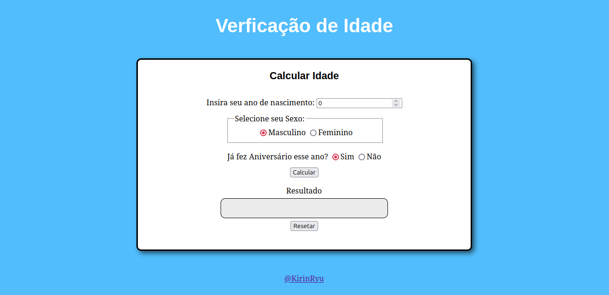
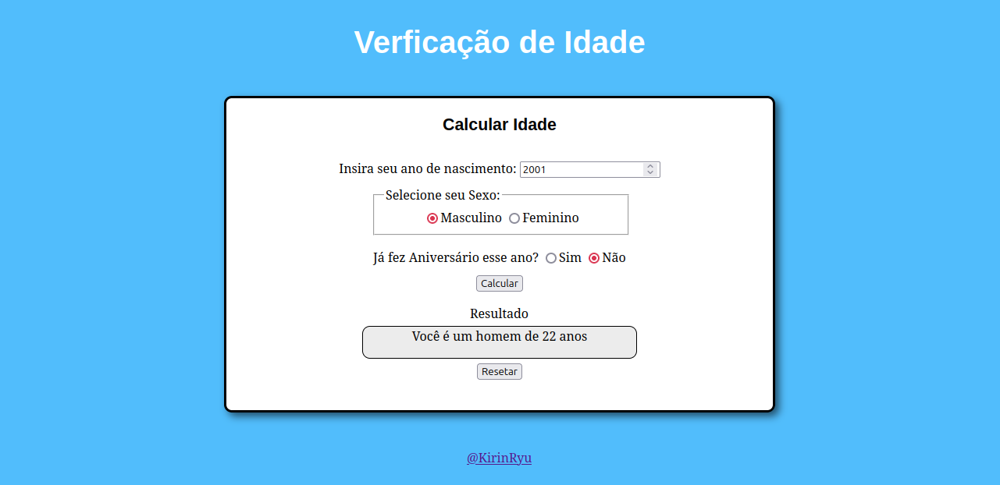

# Calculador de Idade
Este projeto de <b>desenvolvimento web</b>, produzido no <b>VisualStudio</b>, visa calcular a idade do usuário por meio da entrada do ano de nascimento do mesmo. A estrutura e o estilo do desenvolvimento foram
feitos, respectivamente, via <i>HTML</i> e <i>CSS</i>, enquanto a lógica e o cálculo foram feitos através do <i>JavaScript</i>.

Não há nenhum requisito específico para rodar os códigos presentes na pasta <b><i>src</i></b>, clone em um diretório existente no seu computador e o abra com o <b>VisualStudio</b>
(caso nunca tenha mexido com Front-End, é importante baixar a extensão <a href="https://github.com/ritwickdey/vscode-live-server-plus-plus">Live Server</a>).

Página do Projeto
-

  <h4>Assim que executa o projeto com o <b>Live Server</b>, a seguinte página é aberta no seu navegador.</h4>

  
  

---------
  <h4>Ao colocar seus dados e calcular o resultado, este aparecerá no quadro em branco.</h4>

  

